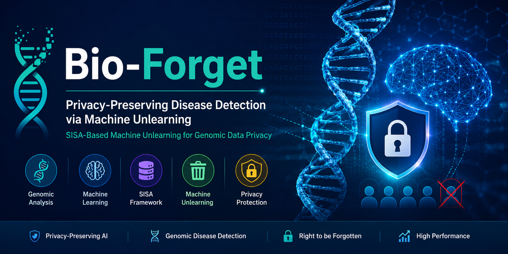
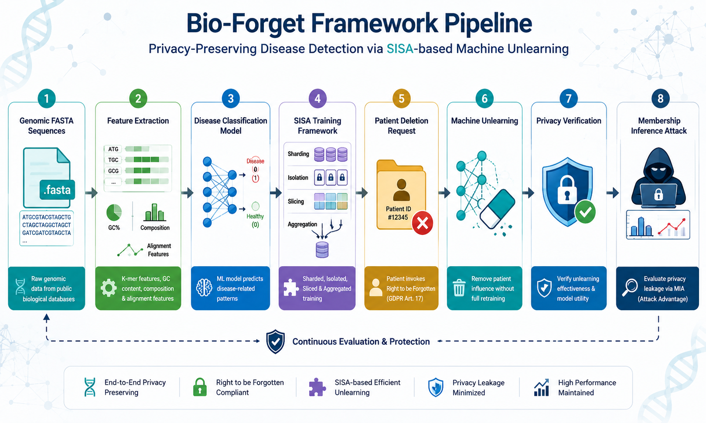
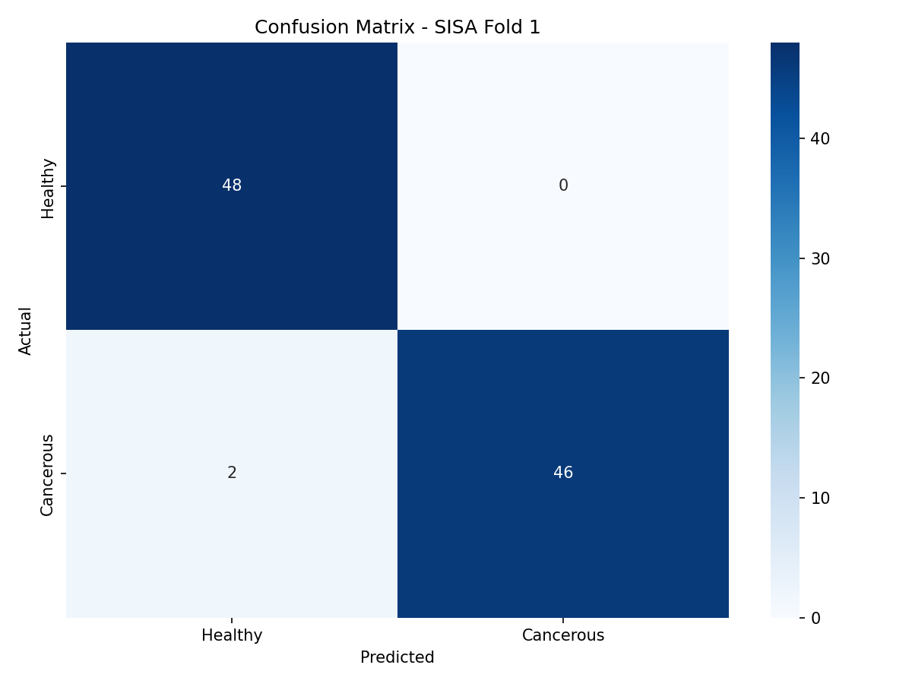
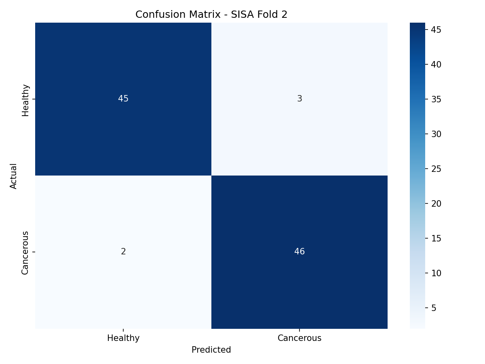
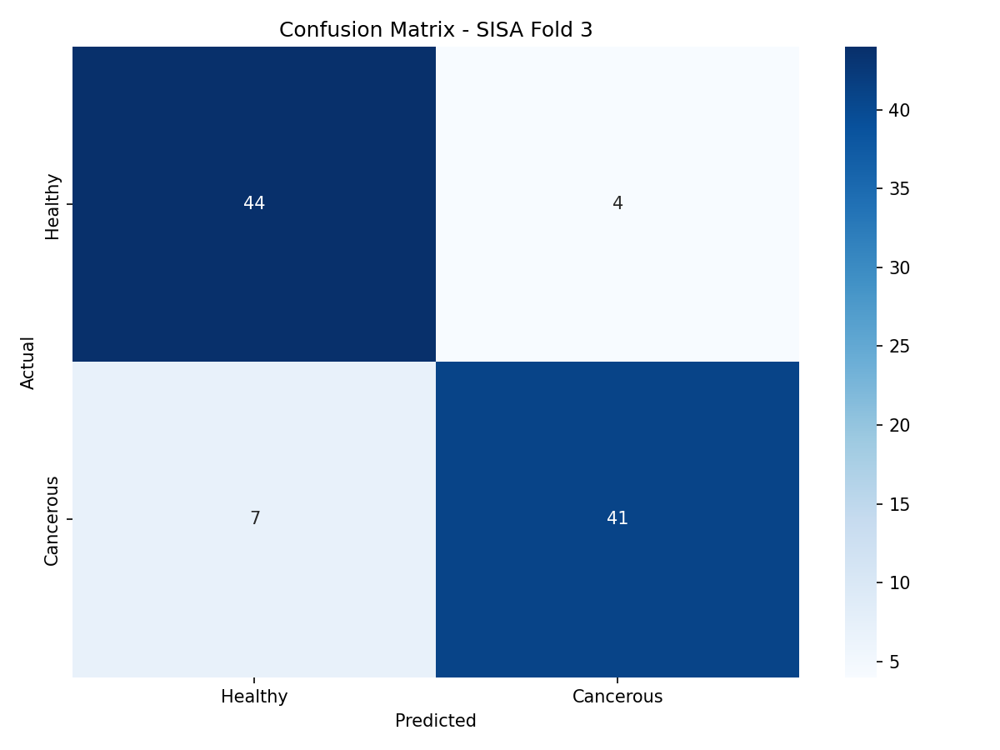
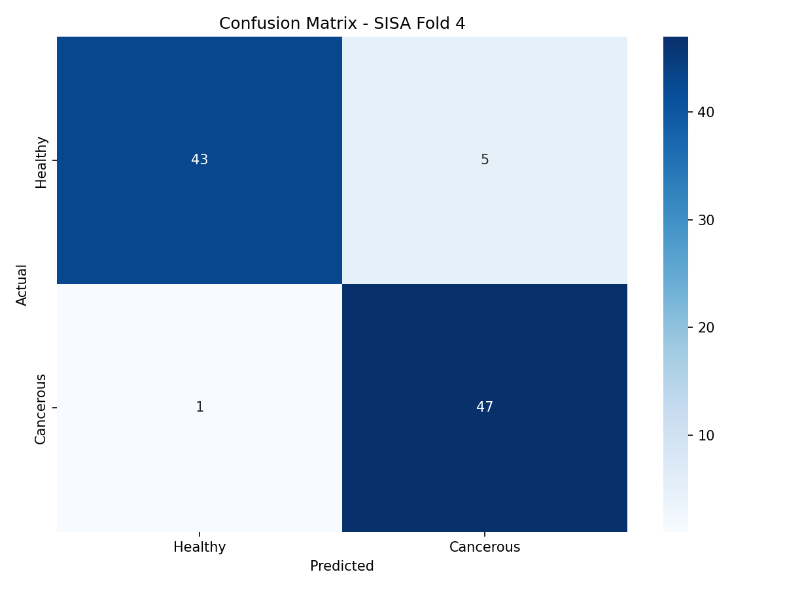
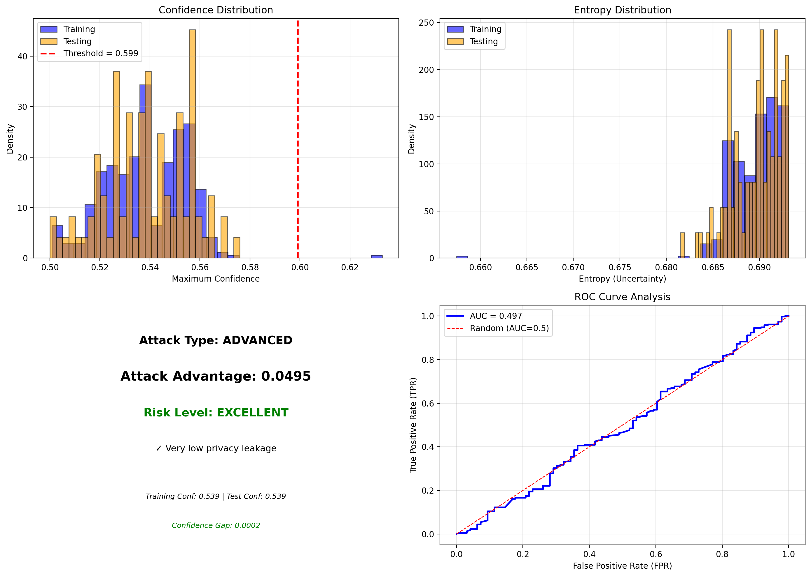

<div align="center">

# 🧬 Bio-Forget

### Privacy-Preserving Disease Detection via Machine Unlearning



<br>

[](https://www.python.org/)
[](https://pytorch.org/)
[](https://scikit-learn.org/)
[](https://numpy.org/)
[](LICENSE)

### AI Framework for Privacy-Preserving Disease Detection from Genomic Data using Machine Unlearning

**Efficient patient-level forgetting with SISA, SCRUB, and Differential Privacy while preserving predictive performance.**

</div>

---

# 📌 Overview

Modern AI systems trained on genomic data face an important privacy challenge: **How can a patient's information be removed after a trained model has already learned from it?**

Traditional approaches require retraining the entire model from scratch whenever a patient requests data deletion, which is computationally expensive and impractical for large-scale healthcare systems.

**Bio-Forget** addresses this problem by implementing an efficient **Machine Unlearning** framework that selectively removes the contribution of individual patients without retraining the complete model.

The framework combines:

- **SISA Training (Sharded, Isolated, Sliced, Aggregated)**
- **SCRUB Machine Unlearning**
- **Differential Privacy**
- **Membership Inference Attack Evaluation**

to create a privacy-preserving AI pipeline suitable for genomic disease prediction.

The project follows the concept of the **Right to be Forgotten (GDPR Article 17)** while maintaining competitive predictive performance.

---
## 📑 Table of Contents

- Overview
- Main Objectives
- Features
- Framework Pipeline
- Dataset
- Model Architecture
- Project Structure
- Experimental Results
- Machine Unlearning
- Privacy Evaluation
- Installation
- Usage
- Future Work
- Citation
- License

---

# 🎯 Key Contributions

- 🧬 Privacy-preserving genomic disease detection framework.
- 🗑️ Patient-level Machine Unlearning.
- ⚡ Efficient SISA-based retraining.
- 🔒 Differential Privacy integration.
- 📊 Membership Inference Attack evaluation.
- 📈 Forget Quality Metrics.
- 🔬 Comparison with Full Retraining.
- 📋 Automated performance reporting.
- 📉 Low privacy leakage with competitive model accuracy.

---

# ✨ Features

## 🧬 Genomic Disease Classification

- FASTA sequence processing
- Biological sequence parsing
- K-mer feature extraction
- Disease-related mutation analysis
- Deep Learning classification

---

## 🗑️ Patient-Level Machine Unlearning

Supports selective removal of individual patients through:

- Patient deletion requests
- Selective retraining
- Forget verification
- Patient traceability

---

## 🧩 SISA Training

Implementation of:

- Sharding
- Isolation
- Slicing
- Aggregation

This greatly reduces retraining cost compared with conventional approaches.

---

## 🔐 Privacy Evaluation

Bio-Forget evaluates privacy using:

- Membership Inference Attack (MIA)
- Attack Advantage
- Privacy Leakage Analysis
- Confidence Gap
- Forget Quality Metrics

---

## 📊 Performance Evaluation

- 5-Fold Cross Validation
- Accuracy
- Precision
- Recall
- F1 Score
- ROC-AUC
- Confusion Matrix
- Full Retraining Comparison

---

# 🏗 Framework Pipeline

<div align="center">



</div>

### Workflow

```
Genomic FASTA Sequences
          │
          ▼
Feature Extraction
          │
          ▼
Deep Learning Disease Classifier
          │
          ▼
SISA Training
          │
          ▼
Patient Deletion Request
          │
          ▼
SCRUB Machine Unlearning
          │
          ▼
Differential Privacy
          │
          ▼
Privacy Verification
          │
          ▼
Membership Inference Attack
```

---
---

# 📁 Project Structure

```text
BIO_FORGET/
│
├── assets/
├── cache/
├── data/
├── models/
├── results/
│   └── cv_results.json
├── src/
│   ├── __init__.py
│   ├── alignment.py
│   ├── baseline.py
│   ├── config.py
│   ├── data_loader.py
│   ├── database.py
│   ├── feature_extraction.py
│   ├── models.py
│   ├── parser.py
│   ├── patient.py
│   ├── performance.py
│   ├── privacy.py
│   ├── sisa.py
│   ├── system.py
│   ├── trainer.py
│   ├── utils.py
│   ├── visualization.py
│
├── bio_forget_complete.db
├── main.py
├── ncbi_data_cached.fasta
├── README.md
├── real_ncbi_data.fasta
├── requirements.txt
├── LICENSE
└── test_import.py
```

---

# 🧬 Dataset

Bio-Forget operates on genomic DNA sequences collected from public biological databases such as **NCBI**.

The framework processes FASTA sequences and transforms them into numerical representations using biological feature engineering techniques, enabling efficient disease classification and privacy-preserving machine unlearning.

### Cancer-related Genes

- TP53
- BRCA1
- BRCA2
- KRAS
- EGFR
- BRAF
- PTEN
- HER2
- MYC
- RB1

---

## Feature Extraction

The system extracts multiple biological representations including:

- K-mer Frequencies (k = 3, 4, 5)
- GC Content
- Sequence Composition
- Alignment-based Features
- Biological Statistics

**Feature Vector Size:** **338 features per patient**

---

# 🧠 Model Architecture

The learning pipeline consists of:

```
DNA Sequence
      │
      ▼
FASTA Parsing
      │
      ▼
Feature Engineering
      │
      ▼
Deep Learning Model
      │
      ▼
SISA Aggregation
      │
      ▼
Machine Unlearning
      │
      ▼
Privacy Verification
```

The architecture combines predictive modeling with privacy-preserving unlearning mechanisms to maintain both utility and patient privacy.

---

# ▶️ Usage

### Run the project

```bash
python main.py
```

The framework will automatically:

1. Load genomic FASTA sequences.
2. Extract biological features.
3. Build feature vectors.
4. Train the disease classification model.
5. Apply SISA training.
6. Evaluate model performance.
7. Process patient deletion requests.
8. Perform Machine Unlearning.
9. Measure privacy leakage.
10. Generate reports and visualizations.

---

# 📊 Generated Outputs

After execution, the framework automatically generates:

```
results/
│
├── cv_results.json
├── performance_metrics.json
├── privacy_report.json
└── unlearning_statistics.json
```

Visualization images are stored inside:

```
assets/
│
├── confusion_matrix_fold_1.png
├── confusion_matrix_fold_2.png
├── confusion_matrix_fold_3.png
├── confusion_matrix_fold_4.png
├── confusion_matrix_fold_5.png
└── privacy_attack_analysis.png
```

---

# 📈 Experimental Results

## 🔬 5-Fold Cross Validation

| Metric | Result |
|---------|---------|
| Accuracy | **93.75 ± 3.02%** |
| AUC | **0.969 ± 0.017** |
| Precision | **0.939** |
| Recall | **0.938** |
| F1 Score | **0.937** |

---

## Fold Performance

| Fold | Accuracy | AUC | Attack Advantage | Status |
|------|----------|------|------------------|---------|
| Fold 1 | 97.92% | 0.983 | 0.1432 | ✅ Successful |
| Fold 2 | 94.79% | 0.988 | 0.0573 | ✅ Successful |
| Fold 3 | 88.54% | 0.947 | 0.1068 | ✅ Successful |
| Fold 4 | 93.75% | 0.977 | 0.1328 | ✅ Successful |
| Fold 5 | 93.75% | 0.951 | 0.0495 | ✅ Successful |

---

# 🗑️ Machine Unlearning Results

| Metric | Result |
|---------|---------|
| Success Rate | **100%** |
| Average Forgetting Time | **9.28 sec** |
| Accuracy Drop | **0.00%** |
| Confidence Change | **0.310** |

---

## Forget Quality Metrics

| Metric | Value |
|---------|---------|
| Parameter Distance | 27170.86 |
| Gradient Similarity | 0.0064 |
| KL Divergence | 12.718 |
| JS Divergence | 0.3276 |

These metrics demonstrate that the patient's contribution was effectively removed while preserving the model's predictive performance.

---

# 🔐 Privacy Evaluation

| Metric | Result |
|---------|---------|
| Attack Advantage | **0.0979** |
| Privacy Leakage | **Low** |

Bio-Forget successfully reduces privacy leakage while maintaining competitive classification performance.

---

# 📊 Confusion Matrices

<div align="center">

### Fold 1 & Fold 2

| Fold 1 | Fold 2 |
|---------|---------|
|  |  |

### Fold 3 & Fold 4

| Fold 3 | Fold 4 |
|---------|---------|
|  |  |

### Fold 5


</div>

---

# 🔐 Privacy Attack Analysis

<div align="center">



</div>

---

# ⚖️ Comparison with Traditional Retraining

| Feature | Bio-Forget | Full Retraining |
|----------|------------|-----------------|
| Patient-level deletion | ✅ | ✅ |
| Full retraining required | ❌ | ✅ |
| Fast forgetting | ✅ | ❌ |
| Privacy evaluation | ✅ | ❌ |
| Differential Privacy support | ✅ | ❌ |
| Computational cost | Low | High |
| Scalability | High | Medium |

---

# 🚀 Future Work

Future improvements include:

- Federated Machine Unlearning
- Transformer-based Genomic Models
- Large-Scale Genomic Datasets
- Explainable AI (XAI)
- Clinical Decision Support Integration
- Web-based Deployment
- Docker Support
- REST API Integration

---

# 🛠️ Technologies Used

## Programming

- Python 3.10+

## Machine Learning

- PyTorch
- Scikit-Learn
- NumPy
- Pandas

## Bioinformatics

- Biopython
- FASTA Processing

## Privacy

- SISA
- Machine Unlearning
- Differential Privacy
- Membership Inference Attack

## Visualization

- Matplotlib
- Seaborn

---

# 📚 References

- Cao & Yang, *Towards Making Systems Forget with Machine Unlearning* (2015)

- Bourtoule et al., *Machine Unlearning (SISA Training)*, IEEE S&P (2021)

- GDPR Article 17 – Right to be Forgotten

- NCBI Gene Database

---

# 👩‍💻 Author

<div align="center">

## Shahd Fayez

Artificial Intelligence Engineer

GitHub

https://github.com/ShahdFayezNegm

LinkedIn

https://www.linkedin.com/in/shahd-fayez-70b9a331b

</div>

---

# ⭐ Support

If you found this project useful,

please consider giving it a ⭐ on GitHub.

It helps the project reach more researchers and developers.

---

# 📜 License

This project is licensed under the **MIT License**.

See the **LICENSE** file for more details.

---

# ⚠️ Disclaimer

Bio-Forget was developed for **research and educational purposes only**.

It is **not intended for clinical diagnosis, medical treatment, or healthcare decision-making**.

Always consult qualified healthcare professionals for medical advice.

---

# 📚 Citation

If you use this project in your research or academic work, please cite it as:

```bibtex
@software{bioforget2026,
  author = {Shahd Fayez},
  title = {Bio-Forget: Privacy-Preserving Disease Detection via Machine Unlearning},
  year = {2026},
  url = {https://github.com/ShahdFayezNegm/Bio-Forget}
}
```

---

# 🙏 Acknowledgments

This project was developed as part of a Bioinformatics and Artificial Intelligence research project.

Special thanks to:

- Open-source Python community
- PyTorch
- Scikit-Learn
- Biopython
- NumPy
- Pandas
- Matplotlib
- Seaborn

The project is inspired by recent research in:

- Machine Unlearning
- Privacy-Preserving Machine Learning
- Genomic AI
- Differential Privacy
- SISA Training

---

# ⭐ Star History

<a href="https://star-history.com/#ShahdFayezNegm/Bio-Forget&Date">
  
</a>

---

<div align="center">

### ⭐ If you like this project, don't forget to give it a Star ⭐

Made with ❤️ by **Shahd Fayez Negm**

</div>